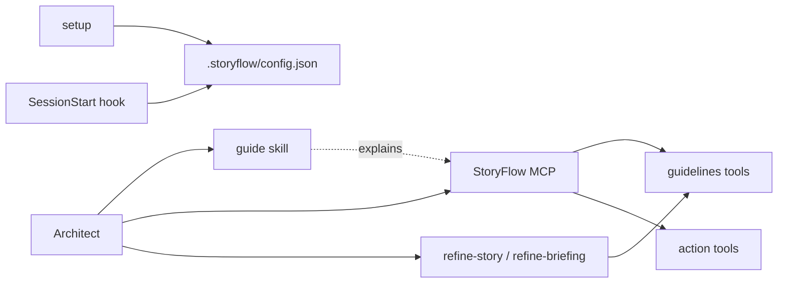

# Plugin scope: the MCP server carries the knowledge, skills only what it cannot

Status: accepted, 2026-08-24

## Context

The plugin had eleven skills, two agents, a hook and a reference file: around 1400 lines. Most of that weight sat in three kinds of content that the plugin does not own.

**Rendering instructions.** `briefings`, `briefing` and `story` spent 243 lines describing how to display what `list-briefings`, `get-briefing` and `get-story` already return. A model needs no instruction to format a response it can read.

**Restated tool contracts.** The MCP tool descriptions are complete. `create-briefing-stories` states its own one-shot constraint. `price-story` states the calculation formula and that committing the price is a separate `transition-story` call. `refine-story` states that it does not transition and points at `get-refinement-guidelines` for the document structure. The skills repeated all of it, which means every backend change had to be chased into the plugin.

**Guidelines that live in the backend.** Six MCP tools serve guidelines: briefing format, story format, briefing-to-stories method, refinement perspectives, pricing, asset documentation. Skills that fetch a guidelines document and then follow it add an orchestration step, not knowledge.

The plugin serves agency Software Architects. They decide how to approach a piece of work. A plugin that wraps every action in a command decides for them, and pays for that in maintenance.

## Decision

The MCP server is the interface. The plugin adds only what cannot be derived from it:

- `setup`, because the config file is a local contract with no backend equivalent.
- `guide`, because the data model, the project-resolution rule and the map of guidelines tools exist nowhere the model can reach on its own.
- `refine-story` and `refine-briefing`, because parallel subagent dispatch and synthesis is machinery, not knowledge. The perspectives themselves still come from `get-refinement-guidelines`.
- The SessionStart hook, because nothing else tells the architect whether this checkout is linked and to which asset.

Everything else is removed.

### Removed

| Removed | What it added beyond MCP and the model |
|---|---|
| `briefings`, `briefing`, `story` | Formatting for data the tools already return |
| `create-briefing` | Nothing: the format comes from `get-briefing-guidelines` |
| `briefing-to-stories` | Nothing: the one-shot rule is in the tool description |
| `implement-briefing`, `briefing-to-plan` | A plan template and an `output_dir` convention |
| `asset-documentation` | Nothing: the format comes from its guidelines tool |
| `price-story` | Nothing: the formula is in the tool description |
| `briefing-planner`, `codebase-analyzer` agents | Their only callers were removed skills |
| `references/project-selection.md` | Absorbed into `guide` |

### The guide skill

Model-invocable, so it loads when StoryFlow work comes up rather than waiting to be typed. It covers what StoryFlow is, the data model, the briefing's derived state, the config and how the active asset is resolved from the cwd, the project-resolution rule, the map of guidelines tools, the story lifecycle, and the two working agreements no tool enforces (show before saving; story generation is one-shot per briefing).

The derived state of a briefing (`in_opmaak`, `overgedragen`, `afgerond`, and the rule that a cancelled or archived story is not relevant) and the briefing's three actions in place of transitions are domain facts that the tools render but never explain. They lived in `storyflow/README.md`, which this decision rewrites, so they move into the guide rather than being lost.

The story lifecycle is named, but as orientation only. Which step is available for a given story comes from `get-story` at read time, which reports the transitions allowed for that story and that role. The guide says so explicitly, because a locally maintained copy of the state machine is exactly the drift this decision removes.

### Config

`output_dir` is dropped from `setup`. Its only consumer was `implement-briefing`; with no skill writing local files, the architect decides where output lands. The config stays version 2: removing an optional key breaks no reader, and an existing config keeps it harmlessly.

### How the plugin describes itself

Three places advertise "browse briefings, turn them into stories, and generate implementation plans": `storyflow/.claude-plugin/plugin.json`, the plugin entry in `.claude-plugin/marketplace.json`, and the plugin table in the root `README.md`. Two of those three activities are no longer commands. All three descriptions move to what the plugin actually offers: the StoryFlow toolset, a guide to working with it, and refinement.

## Rejected alternatives

**Keep the read-only dashboard skills.** They auto-trigger, so they were the plugin's discovery surface. Rejected: `guide` now fills that role, and it explains the domain instead of formatting one response.

**Move the removed knowledge into MCP tool descriptions.** Would have kept the guardrails while dropping the skills. Rejected because it makes every plugin change wait on a backend deploy, and the descriptions already carry what matters.

**Keep `briefing-to-plan` as a template.** Rejected: an implementation plan's shape is a matter of the architect's own preference, and the model produces one without a template.

## Consequences

- Nine commands disappear at once. Published `main` is what users run, so this lands as a single major version with no deprecation window.
- No new MCP tool is used, so the release does not depend on a backend deploy.
- Backend guideline changes now reach the architect without a plugin release.
- Skills no longer cross-reference each other by command name. The hook and `setup` point at `guide`, and `guide` points at MCP tools.
