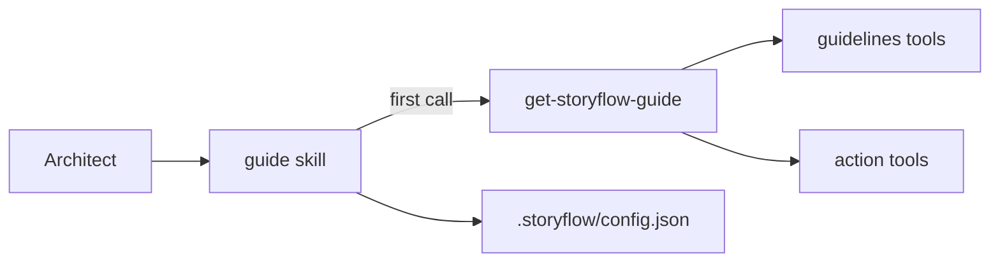

# The guide is served by StoryFlow, the plugin keeps the local contract

Status: accepted, 2026-09-23. Supersedes the rejected alternative "Move the removed knowledge into MCP tool descriptions" in `2026-08-24-plugin-scope.md`.

## Context

After the plugin-scope decision the `guide` skill was the largest piece of knowledge left in the plugin: 231 lines. Around 85% of it described StoryFlow itself (the data model, the lifecycles, briefings, resolving a project, the guidelines map, the story key in git, moving the story with the work). Every change to that behaviour needed a plugin release, and between the two the plugin taught rules the server no longer followed: it still called `Cancelled` terminal after `restore` existed.

## Decision

StoryFlow serves the guide through the MCP tool `get-storyflow-guide` (backend ADR-0030). The `guide` skill calls it first and keeps only the local contract: `.storyflow/config.json` and how the active asset is resolved from the working directory.

The server tailors the guide to the caller's role and fills in the agency's portal host, and a backend test fails when the guide names a tool, transition or status that does not exist.

## Why the earlier rejection no longer holds

The plugin-scope decision rejected moving knowledge to the backend because every plugin change would then wait on a backend deploy. That trade-off inverts for the guide: it describes the backend, so it has to change when the backend changes, and StoryFlow releases far more often than the plugin.

## Rejected alternatives

**Keep the guide in the plugin.** The drift above.

**Only the server instructions.** They load into every session of every user and cannot be tailored per role or agency. They point at the tool instead.

## Consequences

- A plugin release with the slim guide lands after the backend with `get-storyflow-guide` is deployed.
- The guide changes with a StoryFlow release, never with a plugin release.
- Any MCP client, not only Claude Code, gets the same guide.
