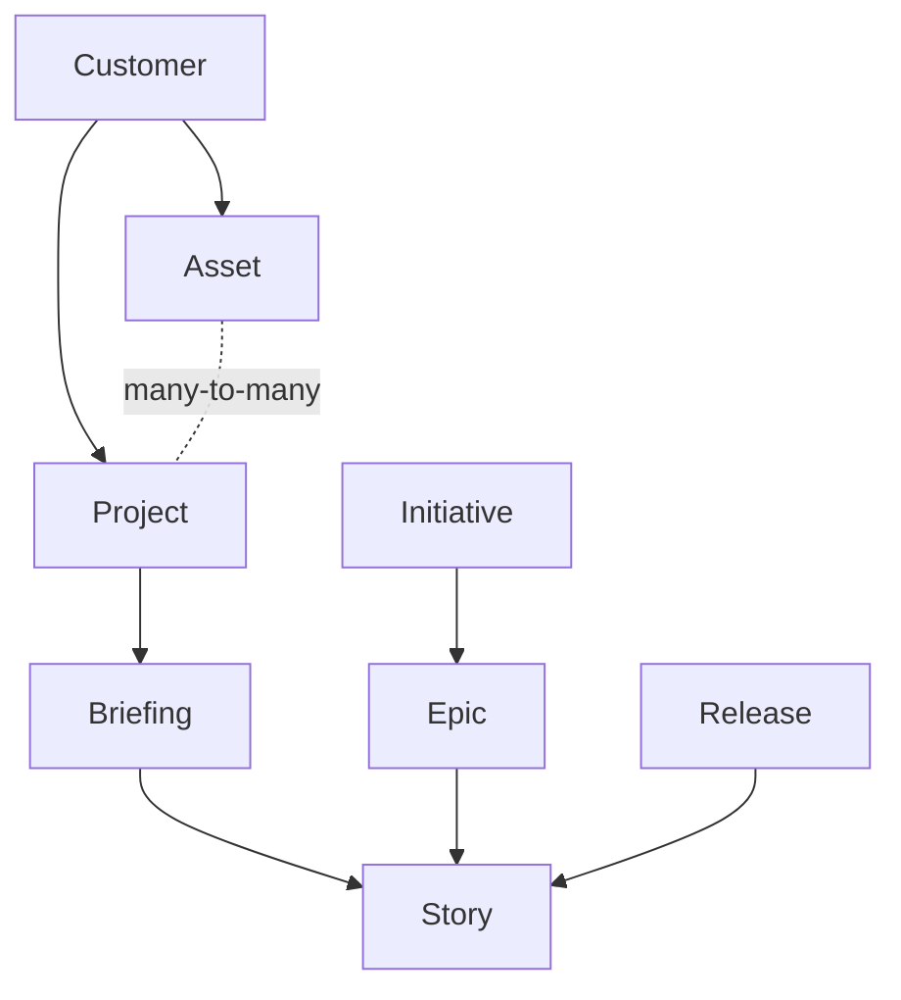

# Plugin Scope Reduction Implementation Plan

> **For agentic workers:** REQUIRED SUB-SKILL: Use superpowers:subagent-driven-development (recommended) or superpowers:executing-plans to implement this plan task-by-task. Steps use checkbox (`- [ ]`) syntax for tracking.

**Goal:** Reduce the StoryFlow plugin to the MCP server, `setup`, a new `guide` skill, `refine-story`, `refine-briefing` and the SessionStart hook, removing nine skills, two agents and the references directory.

**Architecture:** Additive first, then repoint, then delete. The `guide` skill is written before anything is removed, the four survivors are repointed at it while the doomed skills still exist, and only then does the deletion happen. Every commit leaves the repository internally consistent, with no reference to a command that is not there.

**Tech Stack:** Markdown skill files with YAML frontmatter, a bash SessionStart hook, JSON manifests. Verification is `claude plugin validate`, `bash -n` and grep for dangling references. There is no test framework: the red/green cycle is a grep or a validate run that fails before the change and passes after.

**Spec:** `docs/decisions/2026-08-24-plugin-scope.md`

## Global Constraints

- Every user-visible string in the skills and the SessionStart hook is English.
- Leave `version` alone in `storyflow/.claude-plugin/plugin.json` and `.claude-plugin/marketplace.json`. The release picks the number; `deploy-plugin` sets it.
- Document the change under the standing `## Unreleased` heading in `storyflow/CHANGELOG.md`. Keep the heading in place.
- Skills state the correct behavior only. Never narrate what changed.
- Comments explain WHY only.
- Never use an em dash in text content. Use a colon, period, comma or hyphen.
- `claude plugin validate ./storyflow` currently FAILS on `agents/briefing-planner.md` (unparseable frontmatter). It turns green in Task 4, not before. Until then, judge validation by whether the error set is unchanged.

---

### Task 1: Commit the pending legacy-config removal

The working tree carries an unrelated, finished change: all handling of pre-version-2 config was removed. Two of its five files are deleted later in this plan, so it is committed first to keep that work legible in history.

**Files:**
- Modify: none (commit only)

**Interfaces:**
- Consumes: nothing
- Produces: a clean working tree for Task 2

- [ ] **Step 1: Confirm the expected files are dirty**

```bash
git status --short
```

Expected exactly these five, all modified:

```
 M storyflow/CHANGELOG.md
 M storyflow/hooks/scripts/session-context.sh
 M storyflow/skills/create-briefing/SKILL.md
 M storyflow/skills/list-briefings/SKILL.md
 M storyflow/skills/setup/SKILL.md
```

If anything else is dirty, stop and ask.

- [ ] **Step 2: Verify the hook still parses and behaves**

```bash
bash -n storyflow/hooks/scripts/session-context.sh && echo "syntax OK"
d=$(mktemp -d); CLAUDE_PROJECT_DIR="$d" bash storyflow/hooks/scripts/session-context.sh; rm -rf "$d"
```

Expected: `syntax OK`, then `StoryFlow plugin is installed but not configured for this project. Run /storyflow:setup to link this codebase to its StoryFlow asset.`

- [ ] **Step 3: Commit**

```bash
git add -A
git commit -m "refactor(storyflow): drop all handling of pre-version-2 config"
```

- [ ] **Step 4: Verify the tree is clean**

```bash
git status --short
```

Expected: no output.

---

### Task 2: Write the guide skill

The single piece of new content. It absorbs `references/project-selection.md` verbatim and adds the data model, the config, the guidelines map and the two working agreements.

**Files:**
- Create: `storyflow/skills/guide/SKILL.md`

**Interfaces:**
- Consumes: nothing
- Produces: the command `/storyflow:guide`, which Task 3 points the hook, `setup`, `refine-story` and `refine-briefing` at.

- [ ] **Step 1: Verify the command does not exist yet**

```bash
ls storyflow/skills/guide/SKILL.md 2>&1
```

Expected: `No such file or directory`

- [ ] **Step 2: Create the skill**

```bash
mkdir -p storyflow/skills/guide
```

Write `storyflow/skills/guide/SKILL.md` with exactly this content:

````markdown
---
name: guide
description: "How StoryFlow works and how to work with it: the data model, the local config, resolving a project, and which guidelines to fetch before writing. Use whenever working with StoryFlow briefings, stories, epics, releases or refinement."
---

# Working with StoryFlow

StoryFlow is where the agency and its customers meet around a piece of work. A customer files a **briefing** describing what they want. The agency turns it into **stories**, refines them, prices them and delivers. Every artefact reaches you through the `mcp__storyflow__*` tools.

Those tools are the interface, and their descriptions are accurate: read them. This skill covers what a single tool description cannot tell you, namely how the pieces relate, where the local config lives, and which guidelines to fetch before you write anything.

## The data model



- **Customer**: the client. Everything hangs under exactly one.
- **Asset**: a codebase, tied to a git repository. Durable.
- **Project**: a unit of work and budget, with a start and an end. An asset sits in any number of projects at once.
- **Briefing**: the customer's intake. It has no status of its own; its state is derived from the stories made from it.
- **Story**: the unit of work. Carries a status, a refinement and a price.
- **Epic**, **Initiative**, **Release**: grouping above the story.

## Briefings have no status

A briefing is a status-less intake source. The work moves forward through the stories generated from it, and the briefing's own state is computed per read, never stored:

| State | Meaning |
|---|---|
| `in_opmaak` | Not handed over yet and no relevant stories exist. Still being drafted. |
| `overgedragen` | Handed over, or relevant stories exist, but not all of them are delivered. |
| `afgerond` | Relevant stories exist and all of them are delivered. |

A story counts as relevant when it is neither cancelled nor archived, so a briefing whose stories were all cancelled falls back to `in_opmaak`. A briefing in `overgedragen` with `0/0 stories` is a fresh delivery waiting for stories.

In place of transitions a briefing has three actions, each its own tool:

| Tool | Effect |
|---|---|
| `cancel-briefing` | Records the reason as a visible comment, cancels the still-open stories, archives the briefing. One-way. |
| `archive-briefing` | Drops it out of the default listings. Only once every linked story is delivered. |
| `unarchive-briefing` | Restores it. Does not cascade, and does not undo a cancel. |

## The local config

`.storyflow/config.json` in the project root links this checkout to StoryFlow:

```json
{
  "version": 2,
  "customer": { "id": "<uuid>", "name": "<name>" },
  "assets": [
    {
      "id": "<uuid>",
      "key": "<key>",
      "name": "<name>",
      "type": "<type>",
      "repository_url": "<url>",
      "production_url": null,
      "working_dir": "/absolute/path/to/this/checkout"
    }
  ]
}
```

If the file is missing or incomplete, run `/storyflow:setup`.

**Resolving the active asset**: match the current working directory against each asset's `working_dir`, either exactly or as a parent directory. One match is the active asset. Several matches or none: ask which asset to use, do not guess. `assets` is an array because one checkout can hold several assets, as in a monorepo whose parts are separate assets in StoryFlow.

The config holds no project, and no default project per asset. The next section says why.

## Resolving a project

Some artefacts belong to a project: briefings (required), stories (required before they can be approved), epics, initiatives and releases.

The reason there is no project in the config is the data model: an asset sits in any number of projects at once via a many-to-many link. A codebase is durable, a project is a unit of work and budget with a start and an end. "Which project does this checkout belong to" therefore has no answer, while "which project do you book this piece of work under" has one, at the moment the work is created.

### The rule

Resolve the project when an action needs it, never earlier.

1. Call `mcp__storyflow__list-projects` with `assetId` set to the active asset, `customerId` from the config, and `status: "active"`. The `assetId` filter returns exactly the projects the asset is linked to; it accepts the asset UUID or its key.
2. Then, by the number of results:

   - **Exactly one**: use it. Do not ask. Name it in your output ("Project: WDV-PR-9 Maintenance") so the user can correct you.
   - **More than one**: ask with `AskUserQuestion`. Show key, name and billing model per option, and order the most likely first: a project whose name matches the work at hand, otherwise the one with the narrowest asset list (a project dedicated to this asset beats a customer-wide retainer).
   - **None**: the asset is not linked to any active project. Do not fall back to listing every project of the customer: `create-briefing` refuses a project the asset does not belong to, so an unlinked project cannot carry this work. Tell the user to link the asset to a project in StoryFlow, or to create the project there, and stop.

3. Keep the chosen project for the rest of the action. Do not write it to `.storyflow/config.json`.

### What not to do

- Do not ask "which project does this codebase belong to". That question has no answer and the user cannot give a lasting one.
- Do not infer a project from the asset's support project. That field routes incidents; it says nothing about where new work is booked.
- Do not cache a default project anywhere. The next briefing may well belong to another project, and a stale default silently books work against the wrong budget.

## Fetch the guidelines before you write

The agency's standards for every artefact live in the backend, not in this plugin. Fetch them at the moment you need them: they are the source of truth, they match what the in-app assistants use, and they change without a plugin release.

| Before you | Call |
|---|---|
| write a briefing | `get-briefing-guidelines` |
| turn a briefing into stories | `get-briefing-to-stories-guidelines` |
| write or edit a story | `get-story-guidelines` |
| refine a story | `get-refinement-guidelines` |
| price a story | `get-pricing-guidelines` |
| generate asset documentation | `get-asset-documentation-guidelines` |

Do not work from a memory of what a guideline said in an earlier session.

## Statuses and transitions

A story is a real state machine:

`Draft -> Submitted -> Accepted -> Scoped -> Refined -> {Priced ->} ToDo -> Doing -> InReview -> Done`

`Priced` is route-dependent. Projects whose billing model requires story pricing pass through it; fixed-price and non-billable projects move a refined story straight to `ToDo`.

Do not assume which step is available from that diagram: `get-story` returns the transitions available for that story right now, along with the data each one needs, already checked against your role. `transition-story` performs one step, or walks to a target status in a single call.

Storing content and moving a story are separate actions. `refine-story` saves a refinement and `price-story` saves a price; neither changes the status. The matching transition commits it.

## Two things no tool enforces

**Show before you save.** Everything that reaches StoryFlow is read by the customer or billed to them. Present a briefing, a set of stories, a refinement or a price to the architect and wait for approval before calling the tool that writes it.

**Story generation is one-shot.** `create-briefing-stories` runs once per briefing and refuses a second call. Get the whole set right before you send it.
````

- [ ] **Step 3: Verify the frontmatter parses**

```bash
python3 - <<'CHECK'
import re
s = open('storyflow/skills/guide/SKILL.md').read()
m = re.match(r'^---\n(.*?)\n---\n', s, re.S)
assert m, 'no frontmatter block'
fm = m.group(1)
assert fm.count('name:') == 1 and 'name: guide' in fm, 'name'
assert fm.count('description:') == 1, 'description'
assert 'disable-model-invocation' not in fm, 'must stay model-invocable'
assert s.count('## ') >= 7, 'expected at least seven sections'
print('frontmatter OK')
CHECK
```

Expected: `frontmatter OK`. Do not use `claude plugin validate` as the gate here: it stops at the first error, which is still `briefing-planner`, so it never reaches the skills. A skill whose frontmatter fails to parse loads with only its filename and every other field silently dropped, which is exactly the defect `briefing-planner` carries.

- [ ] **Step 4: Verify no dangling command references**

```bash
grep -o "/storyflow:[a-z-]*" storyflow/skills/guide/SKILL.md | sort -u
```

Expected exactly: `/storyflow:setup`

- [ ] **Step 5: Commit**

```bash
git add storyflow/skills/guide/SKILL.md
git commit -m "feat(storyflow): add the guide skill"
```

---

### Task 3: Repoint the survivors and drop output_dir

Runs before the deletion so that the moment the nine skills disappear, nothing points at them. Also removes `output_dir`, whose only consumer (`implement-briefing`) is deleted in Task 4.

**Files:**
- Modify: `storyflow/hooks/scripts/session-context.sh` (two print statements)
- Modify: `storyflow/skills/setup/SKILL.md` (step 4, the config block, the summary block, the closing line, the Reconfiguring paragraph)
- Modify: `storyflow/skills/refine-story/SKILL.md:17`
- Modify: `storyflow/skills/refine-briefing/SKILL.md:17`

**Interfaces:**
- Consumes: `/storyflow:guide` from Task 2
- Produces: a survivor set that references only `/storyflow:setup`, `/storyflow:guide`, `/storyflow:refine-story`, `/storyflow:refine-briefing`

- [ ] **Step 1: Confirm the dangling references exist right now**

```bash
grep -rn "/storyflow:briefings\|/storyflow:briefing " \
  storyflow/hooks/scripts/session-context.sh \
  storyflow/skills/setup/SKILL.md \
  storyflow/skills/refine-story/SKILL.md \
  storyflow/skills/refine-briefing/SKILL.md
```

Expected: four hits. Two in the hook (the single-asset and multi-asset branches), one in `setup`, one in each refine skill. This is the failing state the task fixes.

- [ ] **Step 2: Repoint the hook**

In `storyflow/hooks/scripts/session-context.sh`, replace both occurrences of `Use /storyflow:briefings to see available work.` with `Run /storyflow:guide for how to work with it.`

```bash
sed -i '' 's|Use /storyflow:briefings to see available work\.|Run /storyflow:guide for how to work with it.|g' \
  storyflow/hooks/scripts/session-context.sh
```

- [ ] **Step 3: Verify the hook**

```bash
bash -n storyflow/hooks/scripts/session-context.sh && echo "syntax OK"
d=$(mktemp -d); mkdir -p "$d/.storyflow"
cat > "$d/.storyflow/config.json" <<CFG
{"version":2,"customer":{"id":"c1","name":"Acme"},"assets":[{"name":"Web","working_dir":"$d"}]}
CFG
CLAUDE_PROJECT_DIR="$d" bash storyflow/hooks/scripts/session-context.sh
rm -rf "$d"
```

Expected: `syntax OK`, then `StoryFlow: Connected to Acme / Web. Run /storyflow:guide for how to work with it.`

- [ ] **Step 4: Remove output_dir from setup**

In `storyflow/skills/setup/SKILL.md`, make four edits:

1. Delete this step in full, and renumber the steps that follow it so numbering stays consecutive from 4:

   ```
   4. **Configure output directory**: use `AskUserQuestion` to ask where StoryFlow should save generated files (implementation plans, etc.). Suggest `docs/storyflow/` as default. **Wait for the user's response before proceeding.** The path is relative to this project root.
   ```
2. In the JSON block, delete the `"output_dir": "docs/storyflow"` line and the trailing comma on the line before it.
3. In the summary block, delete the `Output:   [output_dir]` line.
4. In the `Reconfiguring` paragraph, replace `keep `output_dir` plus any extra asset entries whose `working_dir` still exists` with `keep any extra asset entries whose `working_dir` still exists`.

- [ ] **Step 5: Repoint setup's closing line**

Replace:

```
   Suggest starting a new session to see the SessionStart context, and using `/storyflow:briefings` to see available work.
```

with:

```
   Suggest starting a new session to see the SessionStart context, and running `/storyflow:guide` for how to work with StoryFlow from here.
```

- [ ] **Step 6: Repoint the two refine skills**

In `storyflow/skills/refine-story/SKILL.md`, replace line 17:

```
If no ID is provided, ask the user for one. Suggest loading a briefing first with `/storyflow:briefing <id>` to see available stories.
```

with:

```
If no ID is provided, ask the user for one. Call `mcp__storyflow__get-briefing` or `mcp__storyflow__list-stories` to show what is available.
```

In `storyflow/skills/refine-briefing/SKILL.md`, replace line 17:

```
If no ID is provided, ask the user for one. Suggest running `/storyflow:briefings` to see available briefings.
```

with:

```
If no ID is provided, ask the user for one. Call `mcp__storyflow__list-briefings` to show what is available.
```

- [ ] **Step 7: Verify no dangling references remain in the survivors**

```bash
grep -rno "/storyflow:[a-z-]*" \
  storyflow/hooks/scripts/session-context.sh \
  storyflow/skills/setup/SKILL.md \
  storyflow/skills/guide/SKILL.md \
  storyflow/skills/refine-story/SKILL.md \
  storyflow/skills/refine-briefing/SKILL.md | grep -o "/storyflow:[a-z-]*" | sort -u
```

Expected exactly these four lines, nothing else:

```
/storyflow:guide
/storyflow:refine-briefing
/storyflow:refine-story
/storyflow:setup
```

- [ ] **Step 8: Verify output_dir is gone from setup**

```bash
grep -c "output_dir" storyflow/skills/setup/SKILL.md
```

Expected: `0`

- [ ] **Step 9: Commit**

```bash
git add storyflow/hooks/scripts/session-context.sh storyflow/skills/setup/SKILL.md \
  storyflow/skills/refine-story/SKILL.md storyflow/skills/refine-briefing/SKILL.md
git commit -m "refactor(storyflow): point the surviving skills and the hook at the guide"
```

---

### Task 4: Remove the nine skills, two agents and references

A pure deletion. Task 3 guaranteed nothing points at any of it, so this task's gate is that validation turns green and no reference survives anywhere.

**Files:**
- Delete: `storyflow/skills/list-briefings/`, `storyflow/skills/load-briefing/`, `storyflow/skills/load-story/`, `storyflow/skills/create-briefing/`, `storyflow/skills/briefing-to-stories/`, `storyflow/skills/implement-briefing/`, `storyflow/skills/briefing-to-plan/`, `storyflow/skills/asset-documentation/`, `storyflow/skills/price-story/`
- Delete: `storyflow/agents/` (both files and the directory)
- Delete: `storyflow/references/` (one file and the directory)

**Interfaces:**
- Consumes: the repointing from Task 3
- Produces: a plugin with four skills and no agents

- [ ] **Step 1: Record the current validation failure**

```bash
claude plugin validate ./storyflow 2>&1 | tail -8
```

Expected: fails with one error on `agents/briefing-planner.md`, whose frontmatter does not parse. This is the failing state the task fixes.

- [ ] **Step 2: Delete**

```bash
git rm -r -q \
  storyflow/skills/list-briefings \
  storyflow/skills/load-briefing \
  storyflow/skills/load-story \
  storyflow/skills/create-briefing \
  storyflow/skills/briefing-to-stories \
  storyflow/skills/implement-briefing \
  storyflow/skills/briefing-to-plan \
  storyflow/skills/asset-documentation \
  storyflow/skills/price-story \
  storyflow/agents \
  storyflow/references
```

- [ ] **Step 3: Verify exactly four skills remain**

```bash
ls storyflow/skills
```

Expected exactly: `guide`, `refine-briefing`, `refine-story`, `setup`

- [ ] **Step 4: Verify validation now passes**

```bash
claude plugin validate ./storyflow 2>&1 | tail -5
```

Expected: `✔ Validation passed`

- [ ] **Step 5: Verify nothing references the removed material**

```bash
echo "--- removed agents and files ---"
grep -rn "briefing-planner\|codebase-analyzer\|references/project-selection\|briefing-to-plan" \
  storyflow/ --include="*.md" --include="*.sh" --include="*.json" | grep -v CHANGELOG
echo "--- removed commands ---"
grep -rno "/storyflow:\(briefings\|briefing\|story\|create-briefing\|briefing-to-stories\|implement-briefing\|asset-documentation\|price-story\)" \
  storyflow/ --include="*.md" --include="*.sh" | grep -v CHANGELOG
```

Expected: both greps hit `storyflow/README.md` only, which Task 5 rewrites. Nothing from `skills/`, `hooks/` or the manifests.

Do not widen the second grep to bare tool names. `create-briefing`, `create-briefing-stories` and `price-story` are live MCP tools that the guide names on purpose; only the `/storyflow:` command form is a dangling reference.

- [ ] **Step 6: Commit**

```bash
git commit -q -m "refactor(storyflow)!: remove the nine wrapper skills and both agents"
git show --stat --oneline HEAD | head -20
```

Expected: 12 files deleted.

---

### Task 5: Update the manifests and both READMEs

Three places advertise activities that are no longer commands, and the plugin README documents a command table that no longer exists.

**Files:**
- Modify: `storyflow/.claude-plugin/plugin.json` (`description`)
- Modify: `.claude-plugin/marketplace.json` (`plugins[0].description`)
- Modify: `README.md` (plugin table row)
- Modify: `storyflow/README.md` (rewrite)

**Interfaces:**
- Consumes: the four-skill plugin from Task 4
- Produces: manifests that describe what the plugin does

- [ ] **Step 1: Confirm the stale descriptions**

```bash
grep -rn "generate implementation plans" README.md .claude-plugin/marketplace.json storyflow/.claude-plugin/plugin.json
```

Expected: three hits. This is the failing state.

- [ ] **Step 2: Update the plugin manifest**

In `storyflow/.claude-plugin/plugin.json`, set `description` to:

```
The StoryFlow toolset for Software Architects: briefings, stories, refinement and pricing, with a guide to working with them
```

Leave `version` untouched.

- [ ] **Step 3: Update the marketplace manifest**

In `.claude-plugin/marketplace.json`, set `plugins[0].description` to the same string. Leave `version` untouched.

- [ ] **Step 4: Update the root README table row**

In `README.md`, replace the description cell for the `storyflow` row with the same string.

- [ ] **Step 5: Verify both manifests are still valid JSON and pass validation**

```bash
python3 -m json.tool storyflow/.claude-plugin/plugin.json > /dev/null && echo "plugin.json OK"
python3 -m json.tool .claude-plugin/marketplace.json > /dev/null && echo "marketplace.json OK"
claude plugin validate . 2>&1 | tail -3
claude plugin validate ./storyflow 2>&1 | tail -3
```

Expected: both `OK` lines, then `✔ Validation passed` twice.

- [ ] **Step 6: Rewrite the plugin README**

Replace `storyflow/README.md` in full with exactly this content. The briefing model that used to live here has moved into `/storyflow:guide`; the roadmap is dropped because it named commands that no longer exist.

````markdown
# StoryFlow Plugin for Claude Code

Connect Claude Code to the StoryFlow platform. The plugin ships the StoryFlow MCP server plus four skills, for agency Software Architects working on client codebases.

The MCP toolset is the interface: briefings, stories, epics, releases, refinement, pricing, transitions and asset documentation are all tools, and their descriptions carry their own contracts. `/storyflow:guide` explains how the pieces fit together, and loads on its own when StoryFlow work comes up.

## Requirements

- [Claude Code](https://docs.anthropic.com/en/docs/claude-code) installed and running
- A StoryFlow account with an agency role (Software Architect, PO, Admin, or Finance)

## Installation

### 1. Add the marketplace

```
/plugin marketplace add wedevelopnl/storyflow-marketplace
```

### 2. Install the plugin

```
/plugin install storyflow@storyflow-marketplace
```

### 3. Authenticate with StoryFlow

Run the following command to authenticate via your browser:

```
claude mcp auth storyflow
```

This opens your browser where you sign in to StoryFlow. Once approved, Claude Code stores the credentials automatically.

### 4. Configure your project

Start Claude Code in your project directory and run:

```
/storyflow:setup
```

This links the current codebase to its StoryFlow **asset**, detected from the git remote URL. An asset is a codebase belonging to one customer, and it is the only thing a checkout maps onto one-to-one.

Setup does not ask which project the codebase belongs to, because there is no such thing: an asset is worked on under any number of projects at once (a redesign, a maintenance retainer, a release train). Project is a property of the work. Briefings, stories, epics, initiatives and releases pick one when they are created, from the projects that contain the asset (`list-projects` with `assetId`).

### Other MCP clients

The plugin targets Claude Code, but the StoryFlow MCP server works with any MCP client: Claude Desktop, ChatGPT, Cursor, VS Code, or a Personal Access Token bridge for clients without OAuth support. See the [MCP client setup guide](https://git.wdvlp.nl/wedevelop/storyflow/-/blob/main/docs/reference/mcp-client-setup.md) for per-client instructions.

## Skills

| Skill | Description |
|-------|-------------|
| `/storyflow:setup` | Link this codebase to its StoryFlow asset |
| `/storyflow:guide` | How StoryFlow works: the data model, the local config, resolving a project, and which guidelines to fetch before writing |
| `/storyflow:refine-story <id>` | Refine a single story with multi-agent analysis |
| `/storyflow:refine-briefing <id>` | Refine all stories of a briefing with multi-agent analysis |

`/storyflow:guide` is also auto-triggered by Claude when StoryFlow work comes up, so the domain model is available without asking for it.

Everything else runs through the MCP toolset directly.

## Guidelines come from StoryFlow

The agency's standards for writing briefings, writing stories, refining, pricing and documenting an asset are served by the application itself: `get-briefing-guidelines`, `get-story-guidelines`, `get-briefing-to-stories-guidelines`, `get-refinement-guidelines`, `get-pricing-guidelines` and `get-asset-documentation-guidelines`. They are the same ones the in-app assistants use, so a change to agency standards reaches the architect without a plugin release.

## How it works

The plugin uses MCP (Model Context Protocol) to connect to the StoryFlow API. Authentication is handled via OAuth 2.1: Claude Code automatically manages the token lifecycle through the standard MCP OAuth flow.
````

- [ ] **Step 7: Verify the README references only live commands**

```bash
grep -o "/storyflow:[a-z-]*" storyflow/README.md | sort -u
```

Expected exactly:

```
/storyflow:guide
/storyflow:refine-briefing
/storyflow:refine-story
/storyflow:setup
```

- [ ] **Step 8: Verify no agent section survives**

```bash
grep -in "agent" storyflow/README.md
```

Expected: no hit that names `briefing-planner` or `codebase-analyzer`, and no `## Agents` heading. A mention of subagent dispatch inside refinement is fine.

- [ ] **Step 9: Commit**

```bash
git add README.md storyflow/README.md .claude-plugin/marketplace.json storyflow/.claude-plugin/plugin.json
git commit -m "docs: describe the plugin as the toolset plus four skills"
```

---

### Task 6: Write the CHANGELOG entry and verify the whole result

One entry for the whole release, folding in the legacy-config removal from Task 1 rather than leaving it as a separate bullet.

**Files:**
- Modify: `storyflow/CHANGELOG.md` (the `## Unreleased` section)

**Interfaces:**
- Consumes: everything above
- Produces: a release-ready `Unreleased` section for `deploy-plugin`

- [ ] **Step 1: Read the current Unreleased section**

```bash
sed -n '/## Unreleased/,/## 7\.0\.0/p' storyflow/CHANGELOG.md
```

Expected: a `### Removed` heading with the single legacy-config bullet added earlier.

- [ ] **Step 2: Replace it**

Replace everything between `## Unreleased` and `## 7.0.0` with:

```markdown
## Unreleased

### BREAKING CHANGES

**The plugin is the MCP toolset plus four skills.** Nine skills and both agents are removed: `briefings`, `briefing`, `story`, `create-briefing`, `briefing-to-stories`, `implement-briefing`, `briefing-to-plan`, `asset-documentation`, `price-story`, `briefing-planner` and `codebase-analyzer`.

What they wrapped is still there, and closer to the source. The MCP tool descriptions carry their own contracts: `create-briefing-stories` states that generation is one-shot, `price-story` states the calculation formula and that committing the price is a separate `transition-story` call. The agency's standards for briefings, stories, refinement, pricing and documentation come from the `get-*-guidelines` tools, so they now reach the architect without a plugin release.

Remaining: `/storyflow:setup`, `/storyflow:guide`, `/storyflow:refine-story` and `/storyflow:refine-briefing`, plus the SessionStart hook.

### Added

- `/storyflow:guide`: the data model, the local config and how the active asset is resolved from the cwd, the project-resolution rule, a map of which guidelines tool to fetch before which task, and the two agreements no tool enforces (show before saving, story generation is one-shot). Model-invocable, so it loads when StoryFlow work comes up.

### Changed

- `setup` no longer asks for an output directory. `output_dir` had one consumer, `implement-briefing`, and the architect decides where local output lands. An existing config keeps the key; nothing reads it.
- The SessionStart hook and `setup` point at `/storyflow:guide` instead of the removed briefing commands.

### Removed

- All handling of pre-version-2 config. A config with a top-level `project` key is no longer recognised anywhere: the hook reports it as incomplete and `setup` rewrites it from scratch.
- `references/project-selection.md`, absorbed into `/storyflow:guide`.
```

- [ ] **Step 3: Verify the standing heading survived and no version was invented**

```bash
grep -c "^## Unreleased$" storyflow/CHANGELOG.md
git diff --stat storyflow/.claude-plugin/plugin.json .claude-plugin/marketplace.json
```

Expected: `1`, then no diff on the version fields (Task 5 changed only descriptions, already committed).

- [ ] **Step 4: Full verification sweep**

```bash
claude plugin validate . 2>&1 | tail -2
claude plugin validate ./storyflow 2>&1 | tail -2
bash -n storyflow/hooks/scripts/session-context.sh && echo "hook syntax OK"
echo "--- live commands ---"
ls storyflow/skills
echo "--- every command reference in the plugin ---"
grep -rho "/storyflow:[a-z-]*" storyflow/ --include="*.md" --include="*.sh" | sort -u
```

Expected: two `✔ Validation passed`, `hook syntax OK`, exactly four skill directories, and a command list containing only `/storyflow:guide`, `/storyflow:refine-briefing`, `/storyflow:refine-story` and `/storyflow:setup`. The CHANGELOG names removed commands in prose without the `/storyflow:` prefix, so they do not appear here.

- [ ] **Step 5: Verify the hook end to end one last time**

```bash
d=$(mktemp -d); mkdir -p "$d/.storyflow"
cat > "$d/.storyflow/config.json" <<CFG
{"version":2,"customer":{"id":"c1","name":"Acme"},"assets":[{"name":"Web","working_dir":"$d"}]}
CFG
CLAUDE_PROJECT_DIR="$d" bash storyflow/hooks/scripts/session-context.sh
rm -rf "$d"
d=$(mktemp -d); CLAUDE_PROJECT_DIR="$d" bash storyflow/hooks/scripts/session-context.sh; rm -rf "$d"
```

Expected, in order:

```
StoryFlow: Connected to Acme / Web. Run /storyflow:guide for how to work with it.
StoryFlow plugin is installed but not configured for this project. Run /storyflow:setup to link this codebase to its StoryFlow asset.
```

- [ ] **Step 6: Commit**

```bash
git add storyflow/CHANGELOG.md
git commit -m "docs: record the scope reduction under Unreleased"
```

---

## Release

Not part of this plan. `deploy-plugin` runs in the primary checkout, turns `Unreleased` into the new version number, tags and pushes. This is a major version: nine commands disappear at once, and published `main` is what users run. No new MCP tool is used, so the release does not wait on a backend deploy.
