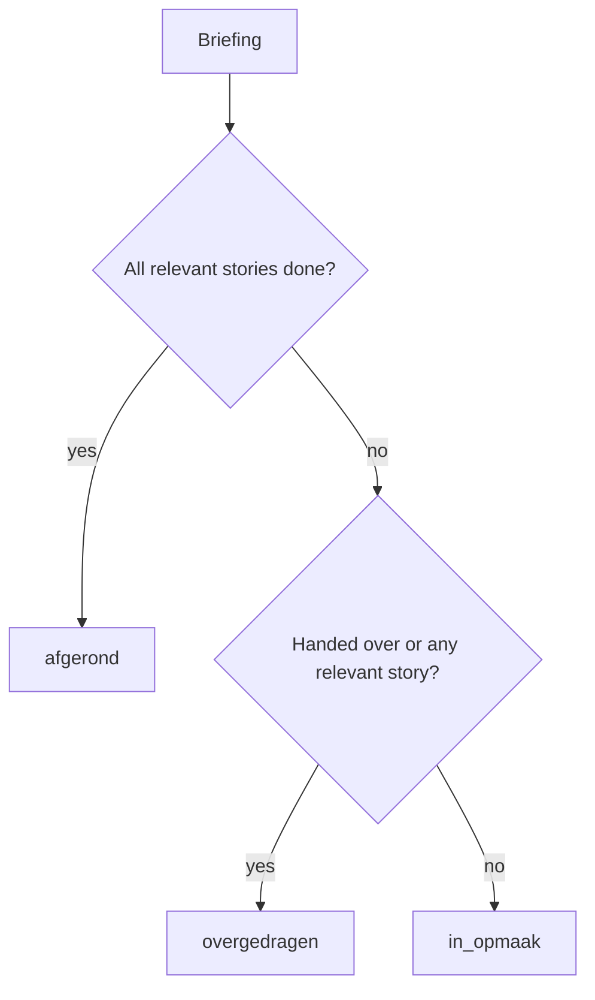

# StoryFlow Plugin for Claude Code

Connect Claude Code to the StoryFlow platform so Software Architects can browse briefings, turn them into stories, and generate implementation plans without leaving the terminal.

## What it does

- **Browse briefings**: View client briefings grouped by their derived state directly in your terminal.
- **Turn intake into work**: Generate stories from a briefing and build structured implementation plans from the stories it contains.
- **Load story context**: Pull individual story details into your session for reference while coding.
- **Generate documentation**: Create or update functional and technical asset documentation from the current codebase.

## Briefing model

A briefing is a **status-less intake source**. It has no workflow status of its own: the work moves forward through the stories generated from it. Only the story lifecycle is a real state machine:

`Draft -> Submitted -> Accepted -> Scoped -> Refined -> {Priced ->} ToDo -> Doing -> InReview -> Done`

`Priced` is route-dependent. Projects whose billing model requires story pricing go through it; fixed-price and non-billable projects move a refined story straight to `ToDo`.

**Derived state (never stored, computed per read):**

| State | Meaning |
|---|---|
| `in_opmaak` | Not handed over yet and no relevant stories exist. The briefing is still being drafted. |
| `overgedragen` | Handed over, or relevant stories exist, but not all of them are delivered. |
| `afgerond` | Relevant stories exist and all of them are delivered. |

A story is "relevant" when it is neither cancelled nor archived; those are excluded from both the state and the counter. So a briefing whose stories were all cancelled falls back to `in_opmaak`.



`list-briefings` and `get-briefing` render this state alongside a `[done]/[total] stories done` counter; `get-briefing` also reports the handoff flag.

**Two flags, two actions:**

- Handoff (`Handed over: yes/no`): the customer has delivered the briefing to the agency.
- Archive: soft-delete. An archived briefing drops out of the default listings and can no longer be modified.

The only briefing-level actions are `cancel` (needs a reason; cascade-cancels the open stories and archives the briefing) and `archive` (allowed once every linked story is delivered). Both go through the `transition-briefing` MCP tool. Story generation is one-shot: `create-briefing-stories` refuses a briefing that is archived or already has stories, and the stories it creates start in `Scoped`.

## Requirements

- [Claude Code](https://docs.anthropic.com/en/docs/claude-code) installed and running
- A StoryFlow account with an agency role (Software Architect, PO, Admin, or Finance)

## Installation

### 1. Add the marketplace

```
/plugin marketplace add wedevelopnl/storyflow-marketplace
```

### 2. Install the plugin

```
/plugin install storyflow@storyflow-marketplace
```

### 3. Authenticate with StoryFlow

Run the following command to authenticate via your browser:

```
claude mcp auth storyflow
```

This opens your browser where you sign in to StoryFlow. Once approved, Claude Code stores the credentials automatically.

### 4. Configure your project

Start Claude Code in your project directory and run:

```
/storyflow:setup
```

This links the current codebase to a StoryFlow project. A project belongs to one customer and contains zero or more assets (codebases). The plugin captures every asset in the project and resolves the active asset per command from the current working directory, so a single config supports both single-repo projects and projects spanning multiple repositories.

### Other MCP clients

The plugin targets Claude Code, but the StoryFlow MCP server works with any MCP client: Claude Desktop, ChatGPT, Cursor, VS Code, or a Personal Access Token bridge for clients without OAuth support. See the [MCP client setup guide](https://git.wdvlp.nl/wedevelop/storyflow/-/blob/main/docs/reference/mcp-client-setup.md) for per-client instructions.

## Skills

| Skill | Description |
|-------|-------------|
| `/storyflow:setup` | Configure plugin for the current project (customer + assets) |
| `/storyflow:briefings [--all]` | List briefings for the active asset, or use `--all` for every project asset |
| `/storyflow:briefing <id>` | Smart briefing dashboard with state-aware next steps |
| `/storyflow:story <id>` | Load individual story details with refinement data |
| `/storyflow:create-briefing [description]` | Create a new briefing from conversation context, plan files, or free text |
| `/storyflow:briefing-to-stories <id>` | Generate user stories from a briefing |
| `/storyflow:refine-story <id>` | Refine a single story with multi-agent analysis |
| `/storyflow:price-story <id>` | Price a refined story using agency-specific pricing guidelines |
| `/storyflow:refine-briefing <id>` | Refine all stories of a briefing with multi-agent analysis |
| `/storyflow:implement-briefing <id>` | Generate an implementation plan from briefing and stories |
| `/storyflow:asset-documentation [type]` | Generate or update asset documentation (`functional`, `technical`, or `both`) |

Note: `/storyflow:briefings`, `/storyflow:briefing`, and `/storyflow:story` are read-only and can also be auto-triggered by Claude when relevant context is detected.

Domain knowledge (how to write stories, refinement output format) is served dynamically by the StoryFlow application via MCP guidelines calls (`get-story-guidelines`, `get-refinement-guidelines`, `get-asset-documentation-guidelines`). The `briefing-to-plan` reference skill provides plan structure and sequencing guidance locally.


## Agents

- **briefing-planner**: Dedicated agent that explores the local codebase and generates an implementation plan from briefing data. Invoked automatically by `/storyflow:implement-briefing`. Uses Opus for plan quality.
- **codebase-analyzer**: Analyzes a codebase from a functional perspective to support story generation. Explores the current project to understand what the application offers and which workflows will be affected by the briefing.
Refinement agents have been removed. Refinement is now handled by the `refine-story` and `refine-briefing` skills, which fetch agent perspectives dynamically from the ai-service via the `get-refinement-guidelines` MCP tool. This ensures the plugin uses the same scoring, synthesis, and agent prompts as the in-app refinement system.

## Workflow

A typical session for a Software Architect:

**Working on existing briefings:**
1. `/storyflow:briefings` to see available work (a briefing in `overgedragen` with `0/0 stories` is a fresh delivery)
2. `/storyflow:briefing <id>` to review a specific briefing
3. `/storyflow:briefing-to-stories <id>` to turn it into stories, if it has none yet
4. `/storyflow:implement-briefing <id>` to generate an implementation plan
5. Execute the plan phase by phase
6. Move stories forward via the `transition-story` MCP tool

**Creating new briefings from context:**
1. Discuss a feature, plan, or requirement in your Claude Code session
2. `/storyflow:create-briefing` to draft a briefing from the conversation
3. Review, iterate, and upload to StoryFlow
4. Share with the client for approval

## How it works

The plugin uses MCP (Model Context Protocol) to connect to the StoryFlow API. Authentication is handled via OAuth 2.1: Claude Code automatically manages the token lifecycle through the standard MCP OAuth flow. All communication goes through the MCP server bundled with the plugin.

## Roadmap

### Future Features

- **Personal dashboard** (`/storyflow:my-work`): View all assigned stories across briefings (requires new MCP tool)
- **Briefing chat** (`/storyflow:ask-briefing`): Ask clarifying questions to the Virtual PO from the terminal (requires new MCP endpoint)
- **Bulk story transitions**: Mark multiple stories as done in one operation
- **Automatic story status sync**: Transition stories based on git commit references
- **Plan completion tracking**: Track implementation progress against the generated plan
