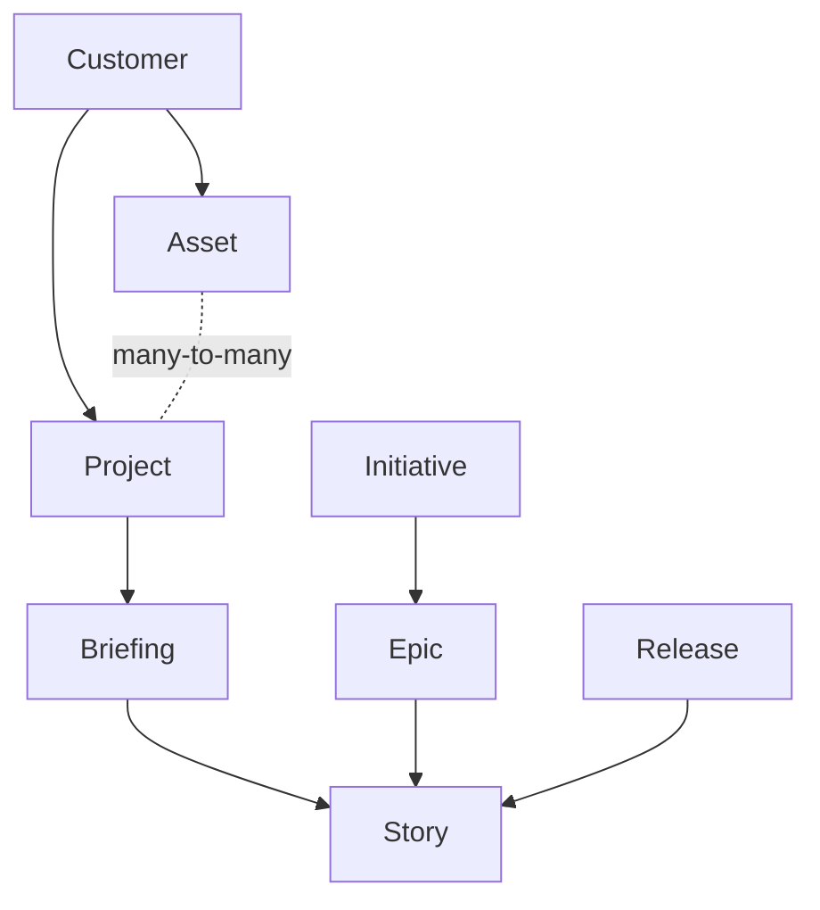

# Working with StoryFlow

StoryFlow is where the agency and its customers meet around a piece of work. A customer files a **briefing** describing what they want. The agency turns it into **stories**, refines them, prices them and delivers. Every artefact reaches you through the `mcp__storyflow__*` tools.

Those tools are the interface, and their descriptions are accurate: read them. This skill covers what a single tool description cannot tell you, namely how the pieces relate, where the local config lives, and which guidelines to fetch before you write anything.

## The data model



- **Customer**: the client. Everything hangs under exactly one.
- **Asset**: a codebase, tied to a git repository. Durable.
- **Project**: a unit of work and budget, with a start and an end. An asset sits in any number of projects at once.
- **Briefing**: the customer's intake. It has no status of its own; its state is derived from the stories made from it.
- **Story**: the unit of work. Carries a status, a refinement and a price.
- **Epic**, **Initiative**, **Release**: grouping above the story.

## Briefings have no status

A briefing is a status-less intake source. The work moves forward through the stories generated from it, and the briefing's own state is computed per read, never stored:

| State | Meaning |
|---|---|
| `in_opmaak` | Not handed over yet and no relevant stories exist. Still being drafted. |
| `overgedragen` | Handed over, or relevant stories exist, but not all of them are delivered. |
| `afgerond` | Relevant stories exist and all of them are delivered. |

A story counts as relevant when it is neither cancelled nor archived, so a briefing whose stories were all cancelled falls back to `in_opmaak`. A briefing in `overgedragen` with `0/0 stories` is a fresh delivery waiting for stories.

In place of transitions a briefing has three actions, each its own tool:

| Tool | Effect |
|---|---|
| `cancel-briefing` | Records the reason as a visible comment, cancels the still-open stories, archives the briefing. One-way. |
| `archive-briefing` | Drops it out of the default listings. Only once every linked story is delivered. |
| `unarchive-briefing` | Restores it. Does not cascade, and does not undo a cancel. |

## The local config

`.storyflow/config.json` in the project root links this checkout to StoryFlow:

```json
{
  "version": 2,
  "customer": { "id": "<uuid>", "name": "<name>" },
  "assets": [
    {
      "id": "<uuid>",
      "key": "<key>",
      "name": "<name>",
      "type": "<type>",
      "repository_url": "<url>",
      "production_url": null,
      "working_dir": "/absolute/path/to/this/checkout"
    }
  ]
}
```

If the file is missing or incomplete, run `/storyflow:setup`.

**Resolving the active asset**: match the current working directory against each asset's `working_dir`, either exactly or as a parent directory. One match is the active asset. Several matches or none: ask which asset to use, do not guess. `assets` is an array because one checkout can hold several assets, as in a monorepo whose parts are separate assets in StoryFlow.

The config holds no project, and no default project per asset. The next section says why.

## Resolving a project

Some artefacts belong to a project: briefings (required), stories (required before they can be approved), epics, initiatives and releases.

The reason there is no project in the config is the data model: an asset sits in any number of projects at once via a many-to-many link. A codebase is durable, a project is a unit of work and budget with a start and an end. "Which project does this checkout belong to" therefore has no answer, while "which project do you book this piece of work under" has one, at the moment the work is created.

### The rule

Resolve the project when an action needs it, never earlier.

1. Call `mcp__storyflow__list-projects` with `assetId` set to the active asset, `customerId` from the config, and `status: "active"`. The `assetId` filter returns exactly the projects the asset is linked to; it accepts the asset UUID or its key.
2. Then, by the number of results:

   - **Exactly one**: use it. Do not ask. Name it in your output ("Project: WDV-PR-9 Maintenance") so the user can correct you.
   - **More than one**: ask with `AskUserQuestion`. Show key, name and billing model per option, and order the most likely first: a project whose name matches the work at hand, otherwise the one with the narrowest asset list (a project dedicated to this asset beats a customer-wide retainer).
   - **None**: the asset is not linked to any active project. Do not fall back to listing every project of the customer: `create-briefing` refuses a project the asset does not belong to, so an unlinked project cannot carry this work. Tell the user to link the asset to a project in StoryFlow, or to create the project there, and stop.

3. Keep the chosen project for the rest of the action. Do not write it to `.storyflow/config.json`.

### What not to do

- Do not ask "which project does this codebase belong to". That question has no answer and the user cannot give a lasting one.
- Do not infer a project from the asset's support project. That field routes incidents; it says nothing about where new work is booked.
- Do not cache a default project anywhere. The next briefing may well belong to another project, and a stale default silently books work against the wrong budget.

## Fetch the guidelines before you write

The agency's standards for every artefact live in the backend, not in this plugin. Fetch them at the moment you need them: they are the source of truth, they match what the in-app assistants use, and they change without a plugin release.

| Before you | Call |
|---|---|
| write a briefing | `get-briefing-guidelines` |
| turn a briefing into stories | `get-briefing-to-stories-guidelines` |
| write or edit a story | `get-story-guidelines` |
| refine a story | `get-refinement-guidelines` |
| price a story | `get-pricing-guidelines` |
| generate asset documentation | `get-asset-documentation-guidelines` |

Do not work from a memory of what a guideline said in an earlier session.

## Statuses and transitions

A story is a real state machine:

`Draft -> Submitted -> Accepted -> Scoped -> Refined -> {Priced ->} ToDo -> Doing -> InReview -> Done`

`Priced` is route-dependent. Projects whose billing model requires story pricing pass through it; fixed-price and non-billable projects move a refined story straight to `ToDo`.

Do not assume which step is available from that diagram: `get-story` returns the transitions available for that story right now, along with the data each one needs, already checked against your role. `transition-story` performs one step, or walks to a target status in a single call.

Storing content and moving a story are separate actions. `refine-story` saves a refinement and `price-story` saves a price; neither changes the status. The matching transition commits it.

## Two things no tool enforces

**Show before you save.** Everything that reaches StoryFlow is read by the customer or billed to them. Present a briefing, a set of stories, a refinement or a price to the architect and wait for approval before calling the tool that writes it.

**Story generation is one-shot.** `create-briefing-stories` runs once per briefing and refuses a second call. Get the whole set right before you send it.
