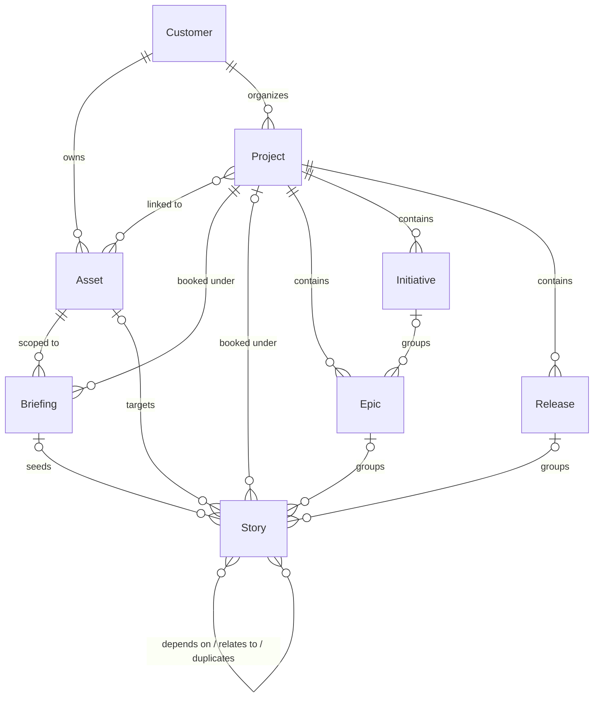

# Working with StoryFlow

StoryFlow runs on **stories**. A story is one piece of work: it carries the description, the refinement, the price, the status and the link to the codebase it changes. Everything the agency delivers or bills moves as a story, and every other artefact either feeds stories or groups them.

A **briefing** is the main feeder. The customer describes what they want in a chat with the Virtual PO and never has to think in stories; the agency reads that intake and turns it into the stories that carry the work.

Every artefact reaches you through the `mcp__storyflow__*` tools. Those tools are the interface, and their descriptions are accurate: read them. This skill covers what a single tool description cannot tell you, namely how the pieces relate, where the local config lives, and which guidelines to fetch before you write anything.

## The data model



- **Customer**: the client. Everything hangs under exactly one, including the artefacts the diagram only shows below a project.
- **Asset**: a durable thing the agency maintains, usually a codebase with a git repository. It outlives any single project.
- **Project**: a unit of work and budget. Carries a billing model, an optional budget and a status (`active`, `completed`, `archived`). An asset sits in any number of projects at once.
- **Briefing**: the customer's intake, always against one project and one asset. It has no status of its own; its state is derived from the stories made from it.
- **Story**: one piece of work. Carries a type (`request`, `incident` or `problem`), a status, a refinement and a price. The type decides which status track applies.
- **Epic**, **Initiative**, **Release**: grouping above the story, each under exactly one project.

Read the cardinalities: `||` is required, `|o` is optional. Only the customer is mandatory on a story. Project, asset, briefing, epic and release are all optional and can be attached later with the `link-story-to-*` tools, so a story does not have to come from a briefing and does not inherit its project or asset from one. A briefing is the exception: it cannot exist without both a project and an asset.

## Stories

The story is the unit of work: refined, priced, delivered and billed one story at a time. It is also a real state machine, and which machine applies depends on its type. A `request` or `problem` story runs:

`Draft -> Submitted -> Accepted -> Scoped -> Refined -> {Priced ->} ToDo -> Doing -> InReview -> Done`

`Priced` is route-dependent. Projects whose billing model requires story pricing pass through it; fixed-price and non-billable projects move a refined story straight to `ToDo` with `ready-to-do`.

`InReview` is the customer's acceptance gate. `accept-delivery` is theirs to give. The agency can record it in their place with `accept-on-behalf`, which takes a reason written for the customer to read. `request-changes` sends the work back to `Doing` for rework within the agreed scope, also with a reason; new requirements are a new story, not a rework loop.

`Done` cannot be cancelled. Abandoning delivered work is deliberately two steps: `return-to-in-review`, then `cancel` from there. An invoiced story cannot do even that.

An `incident` never enters that track. It starts at `Open`, never `Draft`, and runs:

`Open -> Acknowledged -> Investigating -> {Doing ->} Resolved -> Closed`

`resolve` reaches `Resolved` from either `Investigating` or `Doing`, and `reopen` returns a `Resolved` or `Closed` incident to `Investigating`. An incident that turns out to be new work rather than a fault leaves via `promote-to-request`, which moves it to `Submitted` on the request track. That route is open only from `Open`, `Acknowledged` or `Investigating`, and only while the incident carries no price. `Cancelled` is terminal on every track.

Each forward step has a matching `return-to-*` transition, and going back is non-destructive: `return-to-scoped` keeps the refinement, `return-to-priced` and `return-to-refined` keep the price. Correcting a story by moving it back loses nothing.

Do not assume which step is available from these lines: `get-story` returns the transitions available for that story right now, along with the data each one needs, already checked against your role. Two gates block a walk that otherwise looks open: `approve` needs the story to have a project, and `start` needs an architect assigned to it. No tool in this set assigns an architect, so that one ends in the app. `transition-story` performs one step, or walks to a target status in a single call.

Storing content and moving a story are separate actions. `refine-story` saves a refinement and `price-story` saves a price; neither changes the status. The matching transition commits it.

## Briefings

A briefing is intake, not work. The customer describes what they want in a chat with the Virtual PO, and the agency turns that intake into stories with `create-briefing-stories`. From that point the work lives in the stories; the briefing stays behind as the record of what was asked.

That is why a briefing has no status of its own. Its state is derived per read from the stories made from it:

| State | Meaning |
|---|---|
| `in_opmaak` (drafting) | Not handed over yet and no relevant stories exist. |
| `overgedragen` (handed over) | Handed over, or relevant stories exist, but not all of them are delivered. |
| `afgerond` (delivered) | Relevant stories exist and all of them are delivered. |

Those literals are what `list-briefings` filters on, so pass them verbatim.

A story counts as relevant when it is neither cancelled nor archived, so cancelling every story takes the count back to zero: the briefing falls back to `overgedragen` if the customer handed it over, and to `in_opmaak` if they never did. The handover is the customer's own action in the app; no tool in this set performs it. A briefing showing `overgedragen` with `0/0 stories` is a fresh delivery waiting for you to write them.

In place of transitions a briefing has three actions: `cancel-briefing`, `archive-briefing` and `unarchive-briefing`. None of them touch the stories the briefing seeded, so abandoning the work means cancelling each of those stories separately, through its own `cancel` transition.

## The local config

`.storyflow/config.json` in the project root links this checkout to StoryFlow:

```json
{
  "version": 2,
  "customer": { "id": "<uuid>", "name": "<name>" },
  "assets": [
    {
      "id": "<uuid>",
      "key": "<key>",
      "name": "<name>",
      "type": "<type>",
      "repository_url": "<url>",
      "production_url": null,
      "working_dir": "/absolute/path/to/this/checkout"
    }
  ]
}
```

If the file is missing or incomplete, run `/storyflow:setup`.

**Resolving the active asset**: match the current working directory against each asset's `working_dir`, either exactly or as a parent directory. One match is the active asset. Several matches or none: ask which asset to use, do not guess. `assets` is an array because one checkout can hold several assets, as in a monorepo whose parts are separate assets in StoryFlow.

The config holds no project, and no default project per asset. The next section says why.

## Resolving a project

Some artefacts belong to a project: briefings, epics, initiatives and releases cannot exist without one, and a story needs one before it can be approved.

The reason there is no project in the config is the data model: an asset sits in any number of projects at once via a many-to-many link. A codebase is durable, a project is a unit of work and budget that opens and closes. "Which project does this checkout belong to" therefore has no answer, while "which project do you book this piece of work under" has one, at the moment the work is created.

### The rule

Resolve the project when an action needs it, never earlier.

1. Call `mcp__storyflow__list-projects` with `assetId` set to the active asset, `customerId` from the config, and `status: "active"`. The `assetId` filter returns exactly the projects the asset is linked to; it accepts the asset UUID or its key.
2. Then, by the number of results:

   - **Exactly one**: use it. Do not ask. Name it in your output ("Project: WDV-PR-9 Maintenance") so the user can correct you.
   - **More than one**: ask with `AskUserQuestion`. Show key, name and billing model per option, and order the most likely first: a project whose name matches the work at hand, otherwise the one with the narrowest asset list (a project dedicated to this asset beats a customer-wide retainer).
   - **None**: the asset is not linked to any active project. Do not fall back to listing every project of the customer: `create-briefing` refuses a project the asset does not belong to, so an unlinked project cannot carry this work. Tell the user to link the asset to a project in StoryFlow, or to create the project there, and stop.

3. Keep the chosen project for the rest of the action. Do not write it to `.storyflow/config.json`.

### What not to do

- Do not ask "which project does this codebase belong to". That question has no answer and the user cannot give a lasting one.
- Do not infer a project from the asset's support project. That field routes incidents; it says nothing about where new work is booked.
- Do not cache a default project anywhere. The next piece of work may well belong to another project, and a stale default silently books work against the wrong budget.

## Fetch the guidelines before you write

The agency's standards for every artefact live in the backend, not in this plugin. Fetch them at the moment you need them: they are the source of truth, they match what the in-app assistants use, and they change without a plugin release.

| Before you | Call |
|---|---|
| write a briefing | `get-briefing-guidelines` |
| turn a briefing into stories | `get-briefing-to-stories-guidelines` |
| write or edit a story | `get-story-guidelines` |
| refine a story | `get-refinement-guidelines` |
| price a story | `get-pricing-guidelines` |
| generate asset documentation | `get-asset-documentation-guidelines` |

Do not work from a memory of what a guideline said in an earlier session.

## Two things no tool enforces

**Show before you save.** Everything that reaches StoryFlow is read by the customer or billed to them. Present a briefing, a set of stories, a refinement or a price to the architect and wait for approval before calling the tool that writes it.

**Story generation is one-shot.** `create-briefing-stories` runs once per briefing and refuses a second call. Get the whole set right before you send it.
